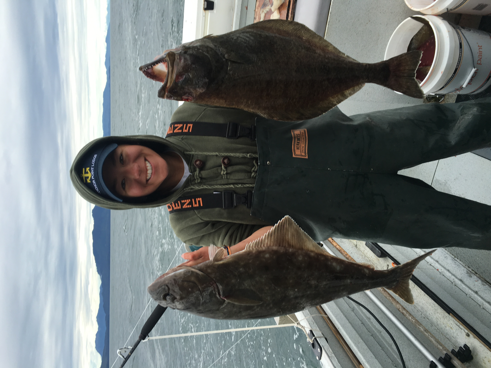

```{r setup, include=FALSE}
knitr::opts_chunk$set(echo = TRUE)
```

# Manuscript Outline

- Data Preparation
- [Analyses](PredationIndex.html)
- Results
- Discussion

```{r graphics, fig.align='left', echo=FALSE}

```

