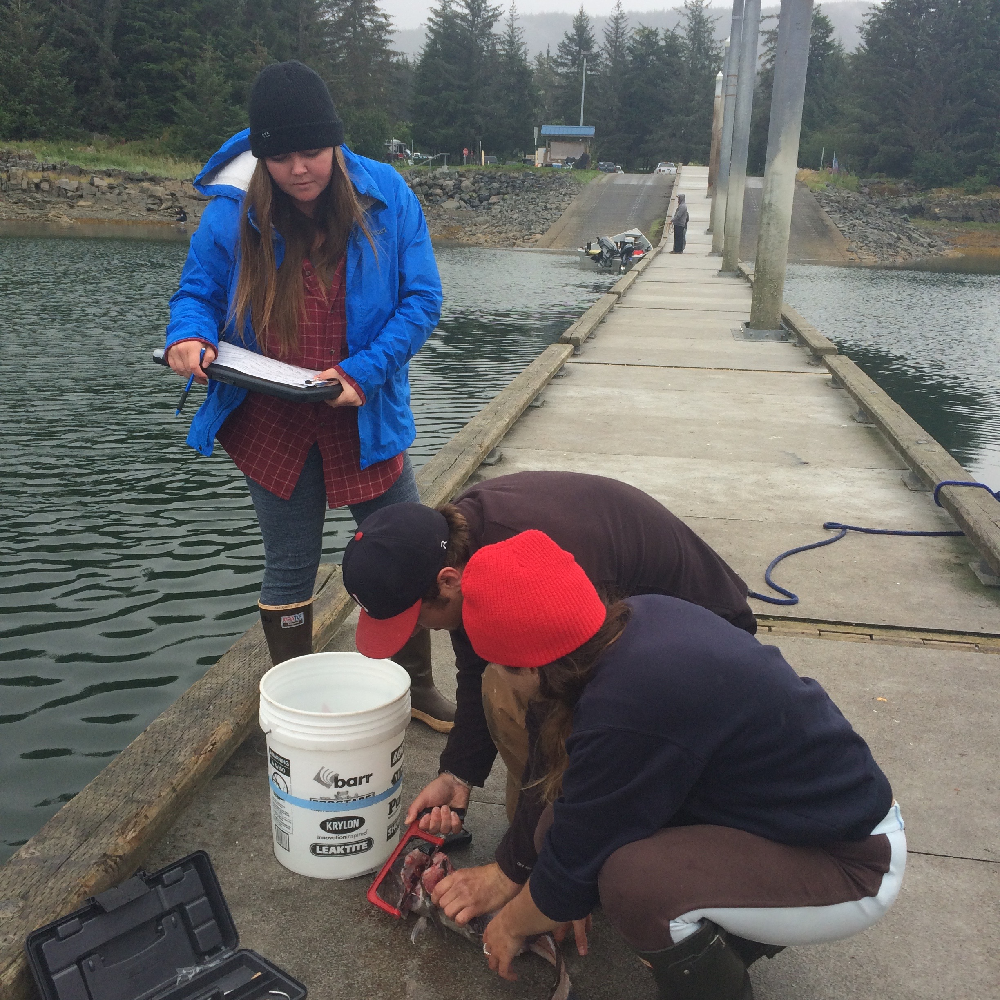

```{r setup, include=FALSE}
knitr::opts_chunk$set(echo = TRUE)
```

# Manuscript Outline

- Data Preparation
- [Analyses](PredationIndex.html)
- Results
- Discussion


<<<<<<< HEAD
```{r graphics, fig.height=1.5, fig.width=2.5, echo=FALSE}
=======
```{r graphics, fig.height=3, fig.width=5, echo=FALSE}
>>>>>>> 45792d88ec89a5150645a7bc1821b6095b802f11

```

